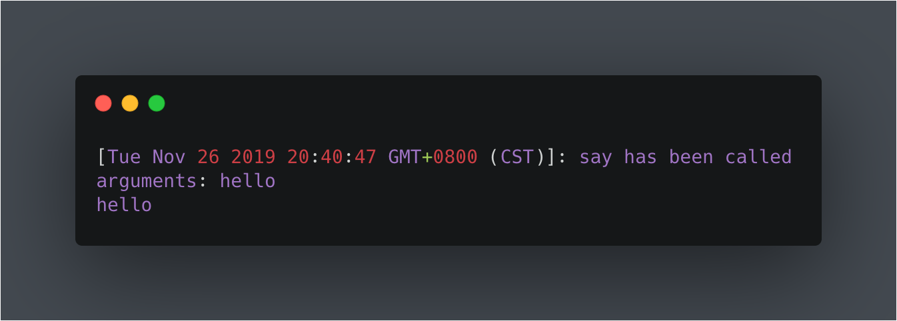
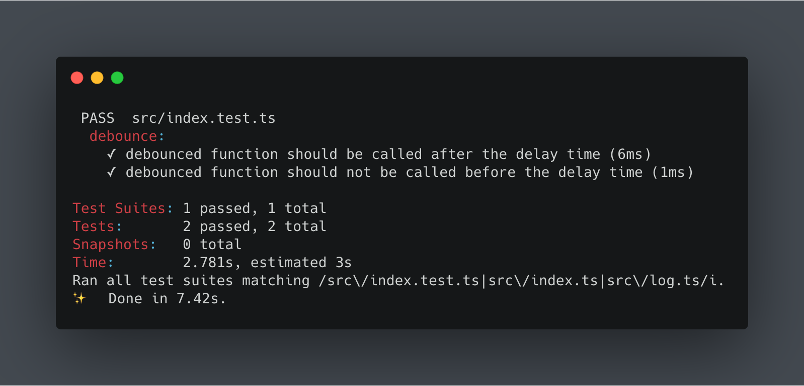

### 如何实现一个debounce装饰器

#### debounce

debounce(去抖动)，是前端开发中常用的高阶函数，用于控制函数调用的频次，用例有控制按钮点击次数，控制浏览器resize触发频次等

实现一个简单的debounce
``` typescript
function debounce(fn: Function, delay: number | string) {
  let timer = null
  return (...args) => {
    if (timer) {
      clearTimeout(timer)
      timer = null
    }

    timer = setTimeout(() => fn(...args), delay)
  }
}
```

#### 装饰器

装饰器本质上也是一个函数，它可以让其它函数或者类在不做代码修改的情况下添加额外的功能，装饰器的返回值也是函数/类。有了装饰器，我们可以将与函数功能
无关的代码抽离到装饰器并复用。

举个例子，我们希望每个函数在被调用的时候都打印一下调用自身的日志，我们可以这样做
```typescript
function log() {
  return (
    target: Object,
    propertyKey: string,
    propertyDesciptor: PropertyDescriptor
  ): any => {
    const method = propertyDesciptor.value;

    propertyDesciptor.value = (...args) => {
      console.log(`[${new Date()}]: ${propertyKey} has been called`);
      console.log(`arguments: ${args}`);
      method(...args);
    };
    return propertyDesciptor;
  };
}

class A {
  @log()
  say(message: any) {
    console.log(message);
  }
}

let a = new A()
a.say('hello')
```
将会输出以下内容


##### 写一个debounce的装饰器
基于以上，很方便的就可以写个debounce的装饰器，代码如下

```typescript
/**
 * 装饰器的debounce
 * @param delay
 */
export function debounce(delay: number): Function {
  return (
    target: Object,
    propertyKey: string,
    propertyDesciptor: PropertyDescriptor
  ) => {
    const method = propertyDesciptor.value;
    let timer = null;
    propertyDesciptor.value = (...args) => {
      if (timer) {
        clearTimeout(timer);
        timer = null;
      }
      timer = setTimeout(() => method(...args), delay);
    };
    return propertyDesciptor;
  };
}
```

写个单元测试验证下装饰器是否有效

+ debounced function 应该在自定delay时间后被执行
+ 如果在delay时间被再次调用，那么它不应该被执行

单元测试代码如下

```typescript
import { debounce } from './index';

jest.useFakeTimers();

let a: any;
let mockFunc: jest.Mock;
beforeEach(() => {
  mockFunc = jest.fn();
  class Test {
    @debounce(1000)
    sayHi() {
      mockFunc();
    }
  }
  a = new Test();
});

describe('debounce:', () => {
  test('debounced function should be called after the delay time', () => {
    a.sayHi();
    expect(mockFunc).toHaveBeenCalledTimes(0);
    jest.advanceTimersByTime(1000);
    expect(mockFunc).toHaveBeenCalledTimes(1);
  });

  test('debounced function should not be called before the delay time', () => {
    a.sayHi();
    expect(mockFunc).toHaveBeenCalledTimes(0);
    let count = 100;
    while (count--) {
      a.sayHi();
    }
    expect(mockFunc).toHaveBeenCalledTimes(0);

    count = 100;
    while (count--) {
      jest.advanceTimersByTime(999);
      a.sayHi();
    }
    expect(mockFunc).toHaveBeenCalledTimes(0);
  });
});

```

测试代码输出以下内容，验证通过



##### [代码地址](https://github.com/feikerwu/debounce-decorator)


