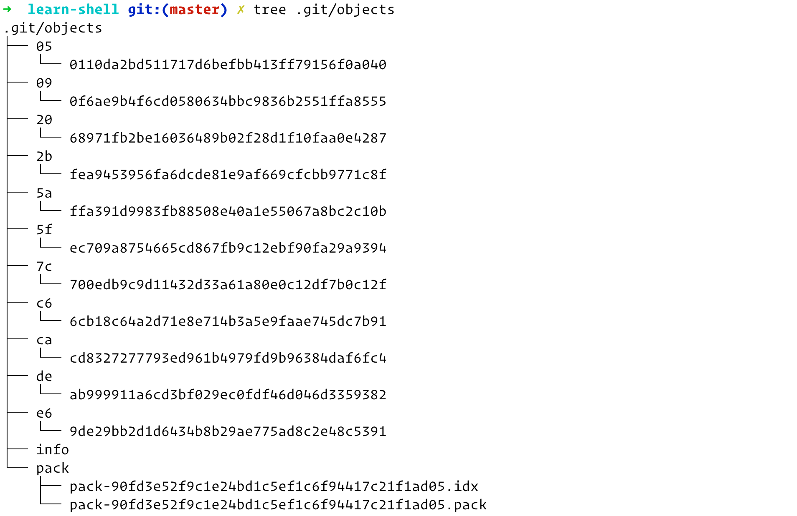
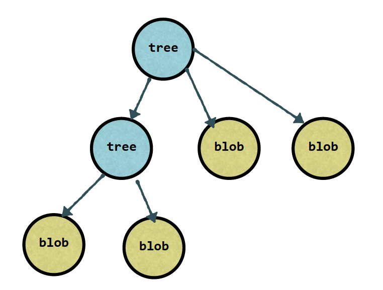
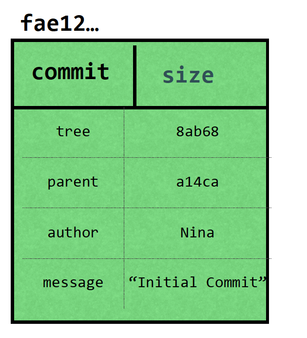

git (分布式版本管理系统) 是目前使用最广泛的一个版本控制系统，知其然以及知其所以然能帮助我们在开发过程中快速定位问题。

#### git 底层

git 是一个内容寻址文件系统，核心部分就是一个简单的 key-value 键值数据库，key 是一个 sha1 计算后的 hash 串，value 是压缩后的数据文件(blob)。

#### blob

git 仓库的所有文件都是用 blob(二进制数据文件)存储的，文件内容存储在.git/objects， 以文件内容的hash值前两位作为目录名，hash2位后作为文件名



git 以 `blob ${文件大小} \0 ${文件内容}` 来计算 hash，通过以下验证

```bash
echo 'test' | git hash-object --stdin
9daeafb9864cf43055ae93beb0afd6c7d144bfa4

echo 'blob 5\0test' | openssl sha1
9daeafb9864cf43055ae93beb0afd6c7d144bfa4
```


可以看到文本 test 通过 git 计算的 hash 和文本`blob 5\0test` 在 sha1 计算的 hash 值一样

#### tree

把文件cat出来，发现是一堆乱码，那是因为blob文件是被压缩过的，文件的头stat信息以及文件组织结构都被丢失了。

git用tree来保存这些信息，一个tree包括了

+ 指向其它tree或者blob的指针
+ 指针类型（它是tree还是blob）
+ 文件名
+ 文件权限（可读，可些，可执行）

可以把master分支上最新提交所指向的树对象打印出来看看

```bash
git cat-file -p master^{tree}

100644 blob 87adace1aa1660900f66db4db04afceb1c9973cd	.gitignore
100644 blob 5312291951904c9402e5b2ef79f3e7d5591e60df	TODO.md
040000 tree d5633113208cb719f0756b122b049f0fb0e1fc6c	dist
040000 tree ba509bd56e0c77ed2581e78c754535d323f7c47b	example
100644 blob bc3140ee20e132f81fbe67c49f4cfdffcbb7d7e3	package-lock.json
100644 blob 15861951236a4b10137918c87bbde51553e50c4b	package.json
040000 tree f27cd1e5968a1d240c3779ee4fd0bcb588f388b5	src
100644 blob e18e7f8d08f47ea47c97725b3eac5d0df80dcbdd	tsconfig.json
```

其实tree就是我们理解数据结果的那个tree，tree的中间节点指向其它的tree，叶子节点指向blob




#### 其它优化

1. 如果git仓库中的存在文件出现多次，比如file-A被拷贝到dir-B/fiel-C，那么这个文件在git里面只会被保存一次，因为它的文件内容是一样，不一样的只是文件名以及文件位置，只要把这些信息保存在tree里面，就可以定位到具体的内容
2. git object 是压缩后的数据，如果 object 过多，git 会把资源数据打包成有个 Packfile，Packfile 保存文件内容，以及每次增量更新的修改。


### commit

每次的commit都指向一个tree，并且包含一些头信息

+ 代码修改者以及提交者
+ 日期
+ commit message
+ 当前commit的上一次提交，如果是merge操作，可能会有多个parent commit

git 会根据以上信息计算一个sha1，作为commit的唯一key 



每个commit都是当前代码的一次快照

可以通过一下操作验证

```bash
# 打印objects下的文件
tree .git/objects

objects/
├── 4b
│   └── 825dc642cb6eb9a060e54bf8d69288fbee4904
├── 9d
│   └── aeafb9864cf43055ae93beb0afd6c7d144bfa4
├── 9e
│   └── a265b576f105b3c7515c691fd6bd2d202d68a8
├── c0
│   └── 7b19257d9414174748d121caf7e6e09c753a6b
├── info
└── pack

# 通过git cat-file -t 找到上次commit提交的sha1
git cat-file -t 9ea265
commit

# 查看上次commit的信息
git cat-file -p 9ea265

tree c07b19257d9414174748d121caf7e6e09c753a6b
author feikerwu <feikerwu@gmail.com> 1576226621 +0800
committer feikerwu <feikerwu@gmail.com> 1576226621 +0800

init

## 可以看到一个commit的包含的所有信息
```


###  references 

head


#### 标签 tags

#### 分支 branch

#### Head


### git 操作


15. tags/branches/HEAD 都是对 commit 的一个引用，指针指向一个 commit 信息
16. 工作区存的是 untracked files, 暂存区存的是已修改代码，准备加入到下一个 commit 的内容
17. git ls-files -s 会显示所有已经加入到暂存区的文件内容
18. git add -p 交互式的添加内容到暂存区
19. git stash --include-untracked // 将包括未跟踪的文件加入到暂存区
20. 通过 git reset 将加入到存储区的内容重置到工作区
21. references 引用指向 commit，包括 tags/branches/HEAD
22. HEAD 指向 Branch， Branch 指向 commit
23. branch 指针随着 commit 提交向前演进
24. tag 是一次快照，定下后不再改变
25. 列出所有已经合入到 master 的分支 git branch —merged master
26. 列出所有没有合入到 master 的分支 git branch --no-merged master
27. git reset —soft HEAD~ 只是简单的移动 HEAD 指针
28. git reset —hard 覆写工作区以及暂存区的内容，并且无法 undone
29. 检出一个远程分支，并且 track git checkout -t origin/feature
30. git branch -vv 查看本地分支和远程分支的追踪情况
31. git pull = git fetch && git merge
32. 查看哪些分支没有被 push git cherry -v


##### 参考

[Git-内部原理-对象](https://git-scm.com/book/zh/v2/Git-内部原理-Git-对象)